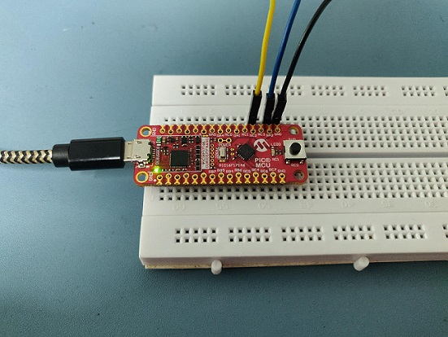
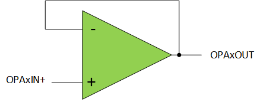
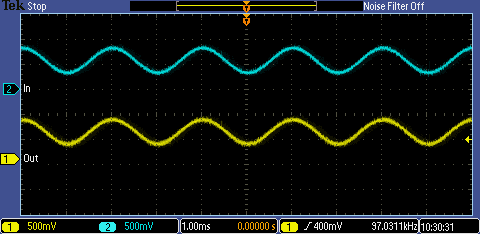
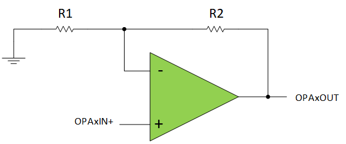
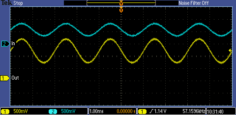
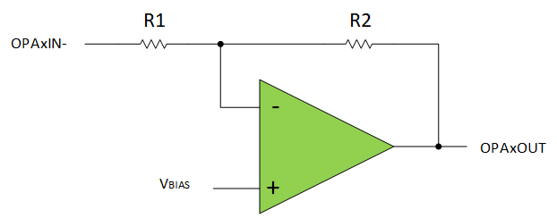
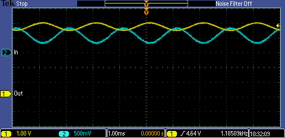
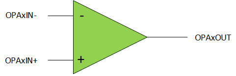

[](https://www.microchip.com)

# Getting Started with OPAMP Configurations on PIC16F17146 Microcontroller

## Introduction

The Operational Amplifier (OPA) module is a powerful analog peripheral available in the [PIC16F17146 family of microcontrollers (MCUs)](https://www.microchip.com/en-us/products/microcontrollers-and-microprocessors/8-bit-mcus/pic-mcus/pic16f17146). The OPA module comes with an internal resistor ladder, which can be used to create a Noninverting or Inverting amplifier with no external components required. An internal multiplexer can set the OPA module into Unity Gain without an external jumper wire. The OPA module also has the option for an external configuration, where the user can use externally placed components to build a custom amplifier configuration. This code example is designed to switch between and demonstrate the four configurations: Unity Gain, Noninverting Amplifier, Inverting Amplifier and External Pin Connections.

## Related Documentation

- [TB3280: Using Operational Amplifiers in PIC16 and PIC18](https://www.microchip.com/DS90003280)
- [TB3279: Optimizing Internal Operational Amplifiers for Analog Signal Conditioning](https://www.microchip.com/DS90003279)
- [AN3521: Analog Sensor Measurement and Acquisition](https://www.microchip.com/DS00003521)
- [PIC16F17146 Data Sheet](https://www.microchip.com/DS40002343)


## Software Used

- [MPLAB® X IDE 6.15](https://www.microchip.com/mplab/mplab-x-ide) or newer
- [Microchip XC8 Compiler 2.45](https://www.microchip.com/mplab/compilers) or newer
- [MPLAB® Code Configurator (MCC) 5.3.7](https://www.microchip.com/mplab/mplab-code-configurator) or newer
- [Microchip PIC16F1xxxx Series Device Support (DFP) 1.20.366](https://packs.download.microchip.com/) or newer

## Hardware Used

-	[PIC16F17146 Curiosity Nano Board](https://www.microchip.com/en-us/development-tool/EV72J15A)
-	Signal Source
-	Parts for an external operational amplifier configuration (resistors, capacitors, etc.)

## Setup

#### Internal Configurations Wiring

##### Pin Table
| Pin | Name          | Function
| --- | ------------- | ---
| RA2 | OPA1IN        | Input
| RC2 | OPA1OUT       | OPA module output
| RC0 | S1            | Push button switch
| RB7 | EUSART TX     | EUSART TX pin
| RB5 | EUSART RX     | EUSART RX pin



| Wire   | Name         | Function
| ---    | -------------| ---
| Blue   | OPA1IN       | Input to the OPA. Connected to a signal source.
| Yellow | OPA1OUT      | Output of the OPA
| Black  | GND          | Ground

These modes of operation (Unity Gain, Noninverting and Inverting) utilize the internal resistor ladder or unity gain override of the OPA module. No external parts are needed for these modes. The internal pin-selection multiplexer is used with each configuration to set RA2 to be the signal input.

**Note:** The internal configuration wiring is the setup used for Unity Gain, Noninverting and Inverting configuration labs. For the external configuration, the setup will vary based on custom design.

#### External Configuration Wiring

##### Pin Table
| Pin | Name          | Function
| --- | ------------- | ---
| RA2 | OPA1IN2+      | Noninverting input
| RC3 | OPA1IN1-      | Inverting input
| RC2 | OPA1OUT       | OPA module output
| RC0 | S1            | Push button switch
| RB7 | EUSART TX     | EUSART TX pin
| RB5 | EUSART RX     | EUSART RX pin

For the external configuration, the internal feedback network is disabled and both inputs of the operational amplifier are connected to the Input/Output (I/O) pins. In this mode, the OPA module on the device acts like a discrete single-supply operational amplifier.

This type of configuration is recommended when the internal resistor ladder is not precise enough or the desired circuit is not possible using the internal resistor ladder (e.g., Summing Amplifier).

#### I/O Cautions
The device will be permanently damaged by voltages above V<sub>DD</sub> and below V<sub>SS</sub>. Do not apply these levels to any I/O on the device. Refer to the device data sheet for more information.

## Operation

This code example demonstrates four basic configurations of the OPA module - Unity Gain, Noninverting, Inverting and External.

Press S1 on the Curiosity Nano board to switch to the next OPA configuration.

The current OPA configuration is displayed on the PC terminal when switching through the labs. Using the Universal Asynchronous Receiver and Transmitter (UART) and the virtual COM port feature of the on-board debugger, the microcontroller sends data to the PC with a baud rate of 9600.


| Configuration                        | Output function
| -----------------------------------  | -----
| Unity Gain                           | V<sub>OUT</sub> = V<sub>IN</sub>
| Noninverting Amplifier              | V<sub>OUT</sub> = 2 x V<sub>IN</sub>
| Inverting Amplifier<sup>*</sup>      | V<sub>OUT</sub> = V<sub>DD</sub> - V<sub>IN</sub>
| External                             | Dependent on the configuration


**Note:** The impedance of the input source affects the transfer function. It is recommended to have a low source impedance for the best results.

#### Unity Gain


In Unity Gain mode, the OPA module acts as a voltage buffer, tracking the input and output signals comparatively to obtain a gain of one. This is most useful for sensitive signals that have a full-scale range, such as resistive voltage dividers.



The code snippet below is an example of configuring the OPA module in Unity Gain. In this example, the OPA module is configured to operate in Unity Gain mode in software by setting the Unity Gain Enable (UG) bit.

```
void ConfigureOPA_UnityGain (void)
{
   //GSEL R1 = 15R and R2 = 1R, R2/R1 = 0.07; RESON Disabled; NSS OPA1IN0-;
    OPA1CON1 = 0x0;

    //NCH No Connection; PCH OPA1IN+;
    OPA1CON2 = 0x2;

    //FMS No Connection; PSS OPA1IN2+;
    OPA1CON3 = 0x2;

    //OREN Software Override; HWCH User Defined Feedback; ORPOL Non Inverted; HWCL User Defined Feedback;
    OPA1HWC = 0x0;

    //ORS OPA1PPS;
    OPA1ORS = 0x0;

    //EN Enabled; CPON Enabled; UG OPA Output; SOC User Defined Feedback;
    OPA1CON0 = 0xA8;
}
```

#### Noninverting Amplifier


The noninverting amplifier produces an output greater than the input signal, with the gain in this configuration being R2/R1 + 1. In this code example, the internal resistor ladder is used to generate a gain of two. However, other gain options are available on the internal resistor ladder.



The code snippet below is an example of configuring the OPA module as a noninverting amplifier.

```
void ConfigureOPA_NonInverting(uint8_t gain)
{
    //GSEL R1 = 8R and R2 = 8R, R2/R1 = 1; RESON Enabled; NSS Vss;
    OPA1CON1 = 0x3F;

    //NCH GSEL; PCH OPA1IN+;
    OPA1CON2 = 0x12;

    //FMS OPA1OUT; PSS OPA1IN2+;
    OPA1CON3 = 0x82;

    //OREN Software Override; HWCH User Defined Feedback; ORPOL Non Inverted; HWCL User Defined Feedback;
    OPA1HWC = 0x0;

    //ORS OPA1PPS;
    OPA1ORS = 0x0;

    //EN Enabled; CPON Enabled; UG OPAIN- pin; SOC User Defined Feedback;
    OPA1CON0 = 0xA0;

    //To set a gain, configure GSEL
    OPA1CON1bits.GSEL = gain;
}
```

#### Inverting Amplifier


The inverting amplifier produces an output that is inverted from the input. Since the OPA module is a single-supply device, the output must be level-shifted for correct operation. V<sub>BIAS</sub> is used to level-shift the output of the operational amplifier in this configuration, with the level set to (1 + R2/R1) * V<sub>BIAS</sub>. The level-shifted gain of this setup is equal to -R2/R1. In this code example, V<sub>DD</sub>/2 is set as V<sub>BIAS</sub> and the internal resistor ladder is used to generate a gain of -1. However, other gain options are available on the internal resistor ladder.



**Note:** The scale for output (yellow) has been increased to 1V/div from 500 mV/div.

The code snippet below is an example of configuring the OPA module as an inverting amplifier.

```
void ConfigureOPA_Inverting(uint8_t gain)
{
    ClearOPAConfiguration();

    //GSEL R1 = 8R and R2 = 8R, R2/R1 = 1; RESON Enabled; NSS OPA1IN2-;
    OPA1CON1 = 0x3A;

    //NCH GSEL; PCH Vdd/2;
    OPA1CON2 = 0x13;

    //FMS OPA1OUT; PSS OPA1IN0+;
    OPA1CON3 = 0x80;

    //OREN Software Override; HWCH User Defined Feedback; ORPOL Non Inverted; HWCL User Defined Feedback;
    OPA1HWC = 0x0;

    //ORS OPA1PPS;
    OPA1ORS = 0x0;

    //EN Enabled; CPON Enabled; UG OPAIN- pin; SOC User Defined Feedback;
    OPA1CON0 = 0xA0;    

    //To set a gain, configure GSEL
    OPA1CON1bits.GSEL = gain;
  }
```

#### External OPA Configuration



In this configuration, the gain of the OPA module is controlled using external components. The input sources to the OPA module are connected to the I/O pins. The noninverting input source of the OPA module is selected using the OPA module Noninverting Input Channel Selection (PCH) bits and can be connected to an external input pin (OPAxIN+). The Positive Source Selection (PSS) bits are used to select from the available OPA noninverting input pins for the device. Similarly, the inverting input source of the OPA module is selected using the OPA module inverting Input Channel Selection (NCH) bits and can be connected to an external input pin (OPAxIN-). The Negative Source Selection (NSS) bits are used to select from
the available inverting OPA input pins for the device. The code snippet below is a example of configuring the gain of the OPA module externally.
```
void ConfigureOPA_External(void)
{
    ClearOPAConfiguration();

    //GSEL R1 = 15R and R2 = 1R, R2/R1 = 0.07; RESON Disabled; NSS OPA1IN1-;
    OPA1CON1 = 0x1;

    //NCH OPA1IN-; PCH OPA1IN+;
    OPA1CON2 = 0x22;

    //FMS No Connection; PSS OPA1IN2+;
    OPA1CON3 = 0x2;

    //OREN Software Override; HWCH User Defined Feedback; ORPOL Non Inverted; HWCL User Defined Feedback;
    OPA1HWC = 0x0;

    //ORS OPA1PPS;
    OPA1ORS = 0x0;

    //EN Enabled; CPON Enabled; UG OPAIN- pin; SOC User Defined Feedback;
    OPA1CON0 = 0xA0;
}
```
## Peripheral Configuration
This section explains how to configure the peripherals using MPLAB X IDE with MCC plugin to recreate the project.

Refer to the [Software Used](https://github.com/microchip-pic-avr-examples/pic16f17146-opamp-getting-started-mplab-mcc#software-used) section to install the required tools.

Additional Links: [MCC Melody Technical Reference](https://onlinedocs.microchip.com/v2/keyword-lookup?keyword=MCC.MELODY.INTRODUCTION&redirect=true)

##### Peripheral Configuration Summary
|    Module                  |    Configuration                                                                                                                                                                                                                                                                                                                                |    Usage                                      |
|--------------------------------|-----------------------------------------------------------------------------------------------------------------------------------------------------------------------------------------------------------------------------------------------------------------------------------------------------------------------------------------------------|---------------------------------------------------|
|    Clock Control           |    Clock Source   - HFINTOSC<br>   HF Internal Clock - 4 MHz<br>   Clock Divider - 4                                                                                                                                                                                                                                                            |    System clock |      
|    EUSART1<sup>(1)</sup>                 |  *UART1 Driver*<br>UART PLIB Selector - EUSART1<br>Requested Baud rate -   9600 <br>  Enable Printf STDIO to EUSART<br><br> *EUSART1 PLIB*     <br>Enable   Receive<br>  Enable Transmit<br>   Enable Serial   Port                                                                                                                                                                          |    Send data to PC   terminal <br>   <br>     |
|    OPA1<sup>(2)</sup>                    |    Enable OPA1<br>   Enable Charge   Pump <br>     <br>Op Amp   Configuration - Unity Gain Buffer<br>    <br>Positive   Channel - OPA1IN+  <br>Positive Source   Selection - OPA1IN2+   <br>Positive   Reference - V<sub>DD</sub>                                                                                         |                                               |
|    TMR2                    |    Enable Timer<br>   <br>Control Mode   - Monostable<br>   External   Reset Source - T2INPPS pin<br>   Start/Reset   Option - Start on rising edge on TMR2_ers<br>     <br>Clock Source   - LFINTOSC<br>   Prescaler -   1:128<br>      Timer Period   - 100 ms<br>    <br>Enable   Interrupt    |    Switch denouncing                          |
|    Pin Settings                    |    *Pin Grid View*<br>OPA1<br>OPA1INx+: RA2<br> OPA1OUT: RC2<br><br> EUSART1<br> RX1: RB5 <br>TX1: RB7 <br> <br>TMR2<br> T2IN: RC0<br><br> GPIO <br> Input: RC0 <br> <br>*Pins*<br>  RC0 <br> Custom Name: SW_S1 <br> Weak Pull-up: Enable  |    Pin Configurations                         |

**Notes:**
1. The on-board debugger on the Curiosity Nano board has a virtual serial port (CDC) connected to the Enhanced Universal Synchronous Asynchronous Receiver Transmitter (EUSART) on the PIC16F17146 and provides an easy way to communicate with the target application through terminal software. Refer to the [Curiosity Nano board user guide](www.microchip.com/DS50003388) for more details.

2. All OPA configuration used in this example are generated separately using MCC (MCC can generate only a single configuration at a time). All <code>OPA1_Initialize()</code> functions generated separately are then added in <code>opa_setup.c</code> file.


## Summary
The OPA module in the PIC16F17146 family is a configurable analog peripheral that can be used in several ways. Each configuration has a specific use case that can aid in signal acquisition applications through an internal connection with the ADC with Computation and Context Switching (ADCC). Other analog peripherals can also utilize the OPA module to unlock new use cases. For instance, the Digital-to-Analog Converter (DAC) output can be mirrored or tracked in output level through the module. The four configurations shown in this code example are the tip of the iceberg - most of the op-amp circuits can be implemented using the OPA module.
